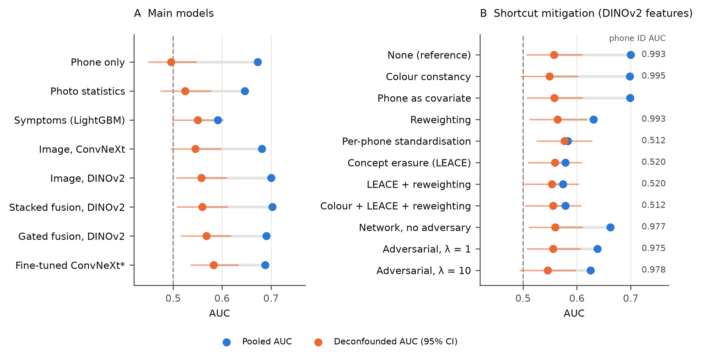
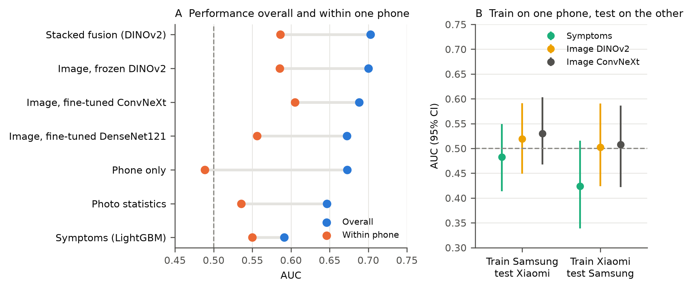

# Recognising the phone, not the throat: shortcuts in smartphone pharyngitis AI

[](https://github.com/sandesh-bhatta-9/pharyngitis-fusion/actions/workflows/tests.yml)
[](LICENSE)
[](https://doi.org/10.6084/m9.figshare.28163513.v1)

Code, fold assignments and out-of-fold predictions for a multimodal benchmark on
[PGUPharyngitis](https://doi.org/10.1038/s41597-025-05780-5), the largest public dataset of smartphone throat photographs
labelled bacterial or non-bacterial by physicians.

We combined throat photographs with symptoms, age and sex, and then tested what the models learn. Most of the image
performance comes from recognising **which phone took the photo**. The two phones were used in two cities with very
different bacterial rates (44% vs 15%), so the phone alone predicts the label about as well as the published deep-learning
baseline. We introduce a **deconfounded AUC**, under which any phone-only model scores 0.5, and compare 13 shortcut
mitigation methods with a probe that measures how much phone information each leaves behind.





## Main results

735 patients, 5-fold cross-validation repeated 5 times with nested tuning (fine-tuned CNNs: one repeat). Full table:
[`results/metrics/summary.md`](results/metrics/summary.md).

| Model | AUC [95% CI] | AUC within one phone | Deconfounded AUC [95% CI] |
| --- | --- | --- | --- |
| Stacked fusion, DINOv2 image + symptoms | 0.703 [0.66, 0.74] | 0.586 | 0.559 [0.51, 0.61] |
| Image only, frozen DINOv2 + logistic regression | 0.700 [0.66, 0.74] | 0.586 | 0.558 [0.51, 0.61] |
| Gated fusion network, DINOv2 | 0.691 [0.65, 0.73] | 0.584 | 0.568 [0.52, 0.62] |
| Image only, fine-tuned DenseNet121 (published: 0.645) | 0.672 [0.63, 0.71] | 0.556 | 0.552 [0.50, 0.61] |
| **Phone model only** | **0.673 [0.63, 0.71]** | 0.488 | 0.496 [0.45, 0.55] |
| **18 colour and brightness statistics** | **0.646 [0.60, 0.69]** | 0.536 | 0.525 [0.47, 0.58] |
| Symptoms only, LightGBM | 0.591 [0.54, 0.64] | 0.550 | 0.550 [0.50, 0.60] |

- Image embeddings identify the phone with an AUC of 0.99.
- Trained on one phone's photos and tested on the other's, image models score AUC 0.50-0.53.
- Adding symptoms never beats the image alone, and the fusion architecture (gate, concatenation, FiLM) makes no difference.
- The conclusions hold under all three rules for tied physician votes.
- Deconfounded, the 0.11 AUC lead of images over symptoms shrinks to 0.01 (p = 0.75).
- Per-phone standardisation and linear concept erasure (LEACE) remove the phone (probe AUC 0.99 -> 0.51) and bring pooled
  AUC down to about 0.58, but no mitigation method raises the deconfounded AUC. Adversarial training lowers AUC while the
  phone stays 97-98% identifiable.

## Setup

Python 3.11. Tested on macOS with an Apple M5 (Metal backend); NVIDIA GPUs are used automatically if present, and
everything except fine-tuning also runs on a CPU.

```bash
git clone https://github.com/sandesh-bhatta-9/pharyngitis-fusion.git
cd pharyngitis-fusion
conda env create -f environment.yml      # or: python -m venv .venv && source .venv/bin/activate && pip install -r requirements.txt
conda activate pharyngitis
python -m pytest -q tests                # 14 unit tests, a few seconds
```

Pretrained weights (ConvNeXt-Tiny, DINOv2 ViT-S/14, DenseNet121, MobileNetV3, about 250 MB in total) are downloaded
from Hugging Face by `timm` on first use.

## Reproduce the paper

```bash
bash scripts/download_data.sh    # 191 MB from Figshare, checksum-verified; see data/README.md
bash scripts/run_all.sh          # data preparation, folds, features, baselines, fusion, ablations, controls
bash scripts/run_extra.sh        # site-shortcut analyses, tie-rule sensitivity, fine-tuning, final metrics and figures
bash scripts/run_mitigation.sh   # deconfounded AUC and shortcut mitigation (about 10 minutes)
```

The first two scripts take about 3 hours on an M-series MacBook. `run_all.sh` stops at the first error; `run_extra.sh` keeps
going and marks failed steps with `!! FAILED` in its output. Results go to `results/` (see [`results/README.md`](results/README.md)) and figures to
`figures/`.

To check the pipeline in a few minutes without the real data:

```bash
python -m src.make_synthetic --n 300
bash scripts/run_all.sh configs/synthetic.yaml
```

The synthetic numbers mean nothing; the run only checks that every step works.

## Running single steps

Every script is run as `python -m src.<name>` from the project root and documents its options with `--help`. Add
`--config configs/tie_nonbacterial.yaml` (or `tie_drop.yaml`) to run any step under a different tie rule, and
`--repeats 1` to training scripts for a quick look.

| Script | What it does |
| --- | --- |
| `prepare_data` | Clean table, labels (majority vote, vote share, agreement), resized images, EXIF phone, audit report |
| `make_folds` | Fixed 5 x 5 folds, stratified on label x phone |
| `extract_features` | Frozen backbone embeddings: test view, flipped view, 10 training augmentations |
| `baselines` | Symptom models, modified McIsaac score, phone-only, image logistic regression, late/early/stacked fusion |
| `fusion` | Gated cross-modal fusion network and its ablations (`--fusion concat/film`, `--hard-labels`, `--aux 0`, ...) |
| `finetune_image` | End-to-end fine-tuning of CNNs (reproduces the published baselines) |
| `site_shortcut` | Image size and photo-statistics baselines, phone identification, within-phone and cross-phone tests |
| `mitigate` | Deconfounded AUC, 13 shortcut-mitigation methods, phone-leakage probe, cross-phone transfer |
| `evaluate` | All metrics from the out-of-fold predictions, with bootstrap CIs |
| `stats` | Nadeau-Bengio corrected t-test, DeLong test, Holm correction, hypotheses H1-H3 |
| `label_dependence` | Unanimous vs split votes, AUC within phone, residual test, symptom knock-outs |
| `explain` | SHAP, gate values, Grad-CAM |
| `figures` | ROC, calibration, decision curves, ablation, subgroups, Figures 3 and 4 |

## Methods in brief

- **Labels:** majority vote of 3-9 physician diagnoses made from the photo and the symptoms; ties count as bacterial
  (alternatives in `configs/tie_*.yaml`). The vote share is kept as a soft label.
- **Exclusions:** patient 666 (no image) and three pairs that share an identical photo (19/23, 218/256, 301/305).
- **Evaluation:** every model uses the same folds; hyperparameters, training length and the decision threshold are chosen
  by inner cross-validation on training data only.
- **Statistics:** model comparisons use the Nadeau-Bengio corrected resampled t-test on fold AUCs, which accounts for
  overlapping training sets, with DeLong tests per repeat and Holm correction.
- **Site:** the data have no city column, so the phone model read from EXIF stands in for site.
- **Deconfounded AUC:** AUC with each patient weighted by P(y) / P(y | phone), so the label is independent of the phone
  and any phone-only score gets 0.5 (`src/mitigate.py`, `shortcut_metrics`).

More detail: [`paper/analysis_plan.md`](paper/analysis_plan.md) and [`data/README.md`](data/README.md).

## Repository layout

```
configs/    default.yaml (main analysis), tie_*.yaml (sensitivity), synthetic.yaml (smoke test)
src/        all code
scripts/    download_data.sh, run_all.sh, run_extra.sh, run_mitigation.sh
tests/      unit tests for the statistics and preprocessing code
data/       raw data (downloaded, not in git) and committed fold assignments
results/    out-of-fold predictions (oof/, mitigation/oof/) and metric tables (metrics/)
figures/    paper figures, PNG (300 dpi) and PDF
paper/      analysis decisions
```

## Citation

If you use this code or the fold assignments, please cite this repository ([`CITATION.cff`](CITATION.cff)) and the
dataset:

> Shojaei N, Rostami H, Barzegar M, et al. A publicly available pharyngitis dataset and baseline evaluations for bacterial
> or nonbacterial classification. *Scientific Data* (2025). https://doi.org/10.1038/s41597-025-05780-5

## License

Code: [MIT](LICENSE). The PGUPharyngitis data are CC BY 4.0 and are not redistributed here; the Grad-CAM figure shows
photographs from the dataset. Labels are physician consensus, not microbiological tests, and nothing in this repository
is intended for clinical use.
